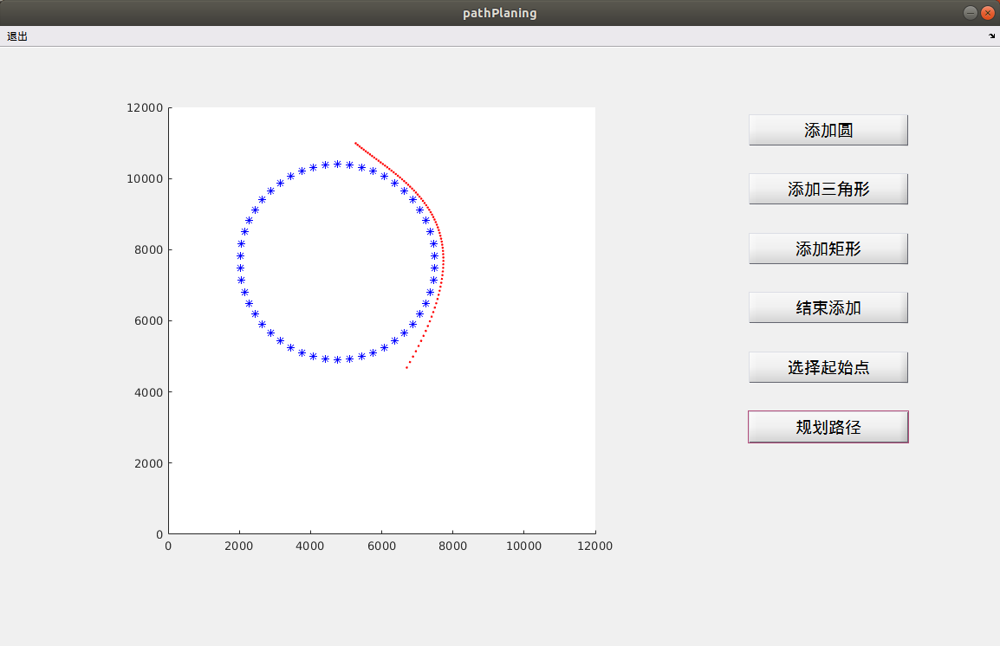
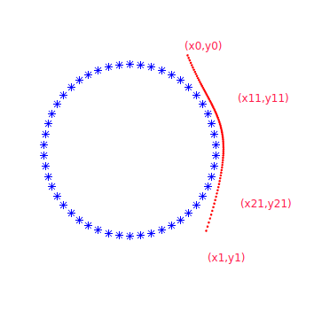

### PSO_PathPlaning

This open source project is a matlab GUI project,is a Robot Path Planing Demo use Particle Swarm Optimization(PSO) algorithm

### Usage

- **Open** and **run** pathPlaning.m

- **Click** button '添加圆' ->**left click and drag** cursor to generate a circle data set->Click button '结束添加'->Click button '选择起始点'->**Left click** and select start-point and end-point->Click button '规划路径'->end

  

### More Usage

- Get result as Bezier curve,result *(x11,y11)* and *(x21,y21)* are Bezier control points,*(x0,y0)* and *(x1,y1)* also.Show as image:



Or can get these result from code below:

```matlab
function pushbutton3_Callback(...)
...
h = waitbar(0,'Please wait...');
while Iter_current < Iter_max
    ...
end
close(h);

x11 = G_best(1)*100; x21 = G_best(3)*100;
y11 = G_best(2)*100; y21 = G_best(4)*100;
x0 = P0(1)*100;
y0 = P0(2)*100;
x1 = P1(1)*100;
y1 = P1(2)*100;
tt = 0:1/79:1;		%steps
x_t1 = (-x0+3.*x11-3.*x21+x1).*tt.^3+(3.*x0-6.*x11+3.*x21).*tt.^2+(-3.*x0+3.*x11).*tt+x0;
y_t1 = (-y0+3.*y11-3.*y21+y1).*tt.^3+(3.*y0-6.*y11+3.*y21).*tt.^2+(-3.*y0+3.*y11).*tt+y0;
%% 绘制路线数据和场地信息数据
plot(x_t1,y_t1,'.r')    %  路线数据
hold on
```

